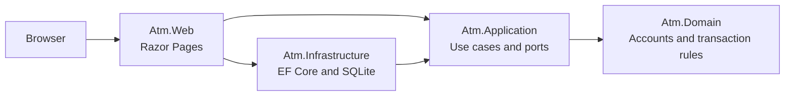

# ATM Technical Plan

## Architecture

Use a modular monolith with dependencies pointing inward:

`Atm.Web` is the composition root. Its reference to Infrastructure exists to register concrete adapters; business behavior must not migrate into the web project.

## Project responsibilities

- `Atm.Domain` — account and transaction concepts, invariants, domain errors; no framework dependencies.
- `Atm.Application` — commands/queries, repository and unit-of-work ports, orchestration; depends only on Domain.
- `Atm.Infrastructure` — EF Core DbContext, SQLite mappings, repositories, migrations, seed data, atomic unit of work.
- `Atm.Web` — Razor Pages, request/view models, validation messages, dependency injection, exception mapping.
- `Atm.Domain.Tests` — fast invariant-focused unit tests.
- `Atm.Application.Tests` — use-case tests with fakes or mocks owned by the test project.
- `Atm.IntegrationTests` — SQLite-backed persistence and ASP.NET Core HTTP tests.

## Initial data model

- `Account`: stable identifier, display name, current decimal balance, concurrency token.
- `Transaction`: stable identifier, UTC timestamp, type, decimal amount, source account when applicable, destination account when applicable, and post-transaction balance data.

The implementation must define the exact history schema before its first migration. Transfers must be auditable without reconstructing facts from mutable account rows.

The domain (phase 1) fixes that schema as follows:

- `Account`: `AccountId` slug (`checking` / `savings`), trimmed display name, `Money` balance, and an integer `Version` incremented on every successful mutation, to be mapped as the EF Core concurrency token.
- `Transaction`: version-7 `Guid` identifier, UTC `DateTime`, `TransactionType` (`Deposit` / `Withdrawal` / `Transfer`), `Money` amount, and two optional sides — `SourceAccountId` + `SourceBalanceAfter`, `DestinationAccountId` + `DestinationBalanceAfter`. Deposits fill only the destination side, withdrawals only the source side, transfers both with distinct accounts. Each account mutation returns the `Transaction` that records it so the application layer persists both in one unit of work.

## Application ports (phase 2)

- `IAccountRepository` — `FindAsync(AccountId)` and `ListAsync()`; repeated lookups within one unit of work return the same tracked instance.
- `ITransactionRepository` — `AddAsync(Transaction)` stages a history record; `ListNewestFirstAsync()` returns history in display order.
- `IUnitOfWork` — `CommitAsync()` writes every staged change atomically and raises `ConcurrencyConflictException` (nothing written) when an account's `Version` no longer matches.
- `IClock` — `UtcNow`; `SystemClock` is the production implementation.

Use cases are plain handler classes: `DepositHandler`, `WithdrawHandler`, `TransferHandler` (each returns a `TransactionSummary` receipt), plus `GetAccountsQuery` and `GetTransactionHistoryQuery`. Commands carry the raw `decimal` amount; the handler converts it with `Money.From` so amount validation has one path. Domain and application exceptions propagate to the presentation layer, which maps them to user-facing messages.

## Persistence (phase 3)

- `AtmDbContext` maps `Account` and `Transaction` directly through value converters: `Money` ↔ `decimal` (precision 18, scale 2), `AccountId` ↔ `string`, and `DateTime` read back with `DateTimeKind.Utc`. `TransactionType` is stored as its name.
- `Account.Version` is the EF Core concurrency token. A stale write updates zero rows, EF raises `DbUpdateConcurrencyException`, and `UnitOfWork` rethrows it as `ConcurrencyConflictException` with nothing written.
- `UnitOfWork.CommitAsync` is one `SaveChangesAsync` call; EF Core wraps it in a single SQLite transaction, which is the atomic boundary for every operation, including a transfer's two account updates and its history row.
- Both transaction sides are enforced foreign keys to `Accounts`; a descending index on `(OccurredAtUtc, Id)` serves the newest-first history query, with the version-7 `Guid` breaking timestamp ties.
- `AtmDatabaseInitializer` runs at host startup: apply pending migrations, then seed Checking and Savings at $1,000.00 only if the `Accounts` table is empty. Seeding is deliberately not done through migration `HasData`, which would treat mutable balances as desired schema state.
- Schema changes go through `dotnet ef migrations add <Name> --project src/Atm.Infrastructure --output-dir Persistence/Migrations`; the design-time factory removes the need for a startup project. An integration test fails if the model has changes without a migration.

## Presentation (phase 4)

- One Razor Page, `Pages/Index`, is the whole UI: two account cards, an operation tablist (`?op=deposit|withdraw|transfer`) that shows one form at a time, and the history table. It works without JavaScript; `site.js` only switches tabs in place, confirms withdrawals and transfers, and disables the submit button while processing. `matrix.js` is an opt-in Konami-code easter egg that re-themes the page and never touches form values.
- Each form posts to its own named handler with its own input model (`DepositInput`, `WithdrawInput`, `TransferInput`) bound by prefix, so a failed submission re-renders with only that form's values and errors.
- Success follows Post/Redirect/Get: the receipt sentence goes into TempData and the redirect returns to the same tab. Failure maps exceptions to fields: `InvalidAmountException` and `InsufficientFundsException` to the amount, `SameAccountTransferException` to the destination, `AccountNotFoundException` to the account that was not found, and `ConcurrencyConflictException` to the form-level summary with its retry message. Unexpected exceptions reach the generic error page, which shows only a request id.
- Money and timestamps are formatted only in `Presentation/Format` (US dollars; UTC, labelled). History rows show a signed amount, the account or accounts, and the post-transaction balance for each side.
- Styling is the tokenized quiet-banking system from `design/README.md`; the Bootstrap and jQuery template assets were removed. Notices carry a text label and an ARIA role so outcome is never conveyed by colour alone.

## HTTP tests and accessibility (phase 5)

- `tests/Atm.IntegrationTests/Http` hosts the real application through `WebApplicationFactory` over an isolated SQLite file, with cookies kept and redirects left unfollowed so Post/Redirect/Get is asserted directly. The factory accepts a database path (to simulate a restart), an environment name, and service overrides.
- Coverage: seeded dashboard, tab selection, each operation's redirect-then-receipt flow with refresh safety, inline overdraft/same-account/invalid-amount/unknown-account errors leaving state unchanged, antiforgery rejection, a concurrency conflict surfacing as a retryable form error, the Production error page hiding exception details, persistence across a host restart, and static-asset resolution.
- `docs/accessibility-review.md` records the manual pass: four fixes (an `h1`, keyboard-reachable tabs without JavaScript, `aria-invalid` on failed controls, a 3:1 control border) and the token contrast table. Structural checks are automated in `AccessibilityStructureTests`.

## Screenshots and deck (phase 6)

- `design/screenshots/*.png` are real captures: the host runs against a scratch SQLite file, curl performs a deposit, withdrawal and transfer through the antiforgery-protected forms, and headless Chrome captures the dashboard, the receipt state, an overdraft error, and a 380px reflow (rendered through a local 380px iframe because headless Chrome enforces a minimum window width).
- `design/atm-deck.pptx` is a build output of `design/deck/build.js` (pptxgenjs; tooling only, outside `Atm.sln`, adding no runtime dependency). Slides follow the outline in `design/README.md` one for one. The generator enforces Jony Vibe's 36-word target while speaker notes carry the narrative and delivery commands.
- The `.pptx` uses the approved Jony Vibe presentation palette: charcoal `#121212`, soft white `#F5F5F5`, and one green, orange, or blue accent per slide. Visual QA exports it to PDF with Microsoft PowerPoint and inspects every slide at presentation size for overflow, screenshot crop, density, and footer collisions. Earlier passes used macOS Quick Look and Keynote, which missed the table cells PowerPoint repaired (`a5f576f`); see `design/README.md`.

## Transaction boundaries

- Deposit: balance update plus history append in one database transaction.
- Withdrawal: sufficient-funds check, balance update, and history append in one database transaction.
- Transfer: source debit, destination credit, and all history data in one database transaction.
- Handle concurrent updates explicitly through an EF Core concurrency token; map conflicts to a safe retry message rather than silently losing updates.

## Implementation sequence

1. Write domain tests for money validation, overdraft prevention, and account mutation; then implement Domain.
2. Define application ports and test each use case; then implement Application.
3. Define the EF Core model, first migration, seed behavior, and SQLite integration tests; then implement Infrastructure.
4. Build thin Razor Pages for dashboard and operations; verify Post/Redirect/Get and error mapping.
5. Add HTTP integration tests and a manual accessibility pass.
6. Capture the finished UI and produce the deck described in `design/README.md`.

Each phase must leave `dotnet build Atm.sln` and `dotnet test Atm.sln` green. New foundational choices require a new ADR before implementation.
