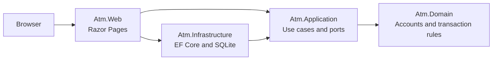

# ATM Technical Plan

## Architecture

Use a modular monolith with dependencies pointing inward:

`Atm.Web` is the composition root. Its reference to Infrastructure exists to register concrete adapters; business behavior must not migrate into the web project.

## Project responsibilities

- `Atm.Domain` — account and transaction concepts, invariants, domain errors; no framework dependencies.
- `Atm.Application` — commands/queries, repository and unit-of-work ports, orchestration; depends only on Domain.
- `Atm.Infrastructure` — EF Core DbContext, SQLite mappings, repositories, migrations, seed data, atomic unit of work.
- `Atm.Web` — Razor Pages, request/view models, validation messages, dependency injection, exception mapping.
- `Atm.Domain.Tests` — fast invariant-focused unit tests.
- `Atm.Application.Tests` — use-case tests with fakes or mocks owned by the test project.
- `Atm.IntegrationTests` — SQLite-backed persistence and ASP.NET Core HTTP tests.

## Initial data model

- `Account`: stable identifier, display name, current decimal balance, concurrency token.
- `Transaction`: stable identifier, UTC timestamp, type, decimal amount, source account when applicable, destination account when applicable, and post-transaction balance data.

The implementation must define the exact history schema before its first migration. Transfers must be auditable without reconstructing facts from mutable account rows.

The domain (phase 1) fixes that schema as follows:

- `Account`: `AccountId` slug (`checking` / `savings`), trimmed display name, `Money` balance, and an integer `Version` incremented on every successful mutation, to be mapped as the EF Core concurrency token.
- `Transaction`: version-7 `Guid` identifier, UTC `DateTime`, `TransactionType` (`Deposit` / `Withdrawal` / `Transfer`), `Money` amount, and two optional sides — `SourceAccountId` + `SourceBalanceAfter`, `DestinationAccountId` + `DestinationBalanceAfter`. Deposits fill only the destination side, withdrawals only the source side, transfers both with distinct accounts. Each account mutation returns the `Transaction` that records it so the application layer persists both in one unit of work.

## Application ports (phase 2)

- `IAccountRepository` — `FindAsync(AccountId)` and `ListAsync()`; repeated lookups within one unit of work return the same tracked instance.
- `ITransactionRepository` — `AddAsync(Transaction)` stages a history record; `ListNewestFirstAsync()` returns history in display order.
- `IUnitOfWork` — `CommitAsync()` writes every staged change atomically and raises `ConcurrencyConflictException` (nothing written) when an account's `Version` no longer matches.
- `IClock` — `UtcNow`; `SystemClock` is the production implementation.

Use cases are plain handler classes: `DepositHandler`, `WithdrawHandler`, `TransferHandler` (each returns a `TransactionSummary` receipt), plus `GetAccountsQuery` and `GetTransactionHistoryQuery`. Commands carry the raw `decimal` amount; the handler converts it with `Money.From` so amount validation has one path. Domain and application exceptions propagate to the presentation layer, which maps them to user-facing messages.

## Transaction boundaries

- Deposit: balance update plus history append in one database transaction.
- Withdrawal: sufficient-funds check, balance update, and history append in one database transaction.
- Transfer: source debit, destination credit, and all history data in one database transaction.
- Handle concurrent updates explicitly through an EF Core concurrency token; map conflicts to a safe retry message rather than silently losing updates.

## Implementation sequence

1. Write domain tests for money validation, overdraft prevention, and account mutation; then implement Domain.
2. Define application ports and test each use case; then implement Application.
3. Define the EF Core model, first migration, seed behavior, and SQLite integration tests; then implement Infrastructure.
4. Build thin Razor Pages for dashboard and operations; verify Post/Redirect/Get and error mapping.
5. Add HTTP integration tests and a manual accessibility pass.
6. Capture the finished UI and produce the deck described in `design/README.md`.

Each phase must leave `dotnet build Atm.sln` and `dotnet test Atm.sln` green. New foundational choices require a new ADR before implementation.
